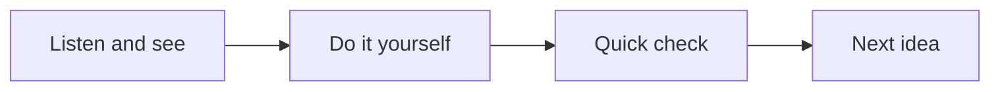
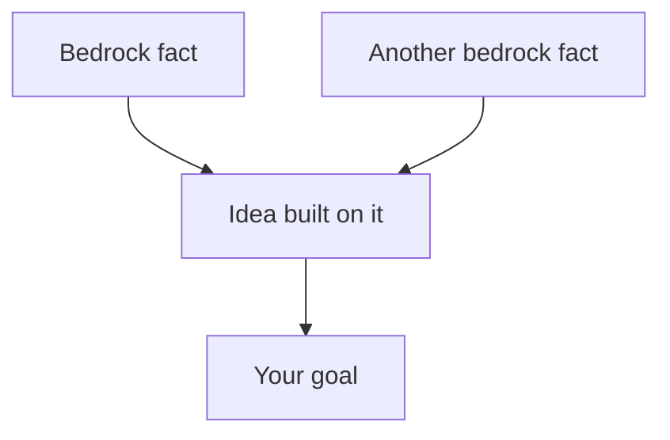

# Welcome to Classroom

About this page

This sample lesson tests the viewer: audio, diagrams and practice files.

## How a lesson works

Welcome to Classroom. Every lesson here runs the same way.

First, you listen and look. Each idea gets a short section like this one, read aloud, with a picture beside it.

Then you do something with your hands. That might be writing a bit of code, making a prediction, or working out a small problem.

Finally, a quick question in the chat checks that the idea landed. In the diagram, follow the arrows from listen, to do, to check, and then on to the next idea.

## Before we start, a map

Before any teaching, Claude asks you a few questions to find where your knowledge runs out. Then it draws a map like the one in the picture.

The ideas at the top are facts you can accept as they are. Every idea below them is built from the ones above. Your goal sits at the bottom.

We walk that map from top to bottom, one idea at a time.

### Practice

Open the file `lessons/welcome/practice/hello.py` and change the name to your own. Then run it with `python lessons/welcome/practice/hello.py` and see what it prints.
